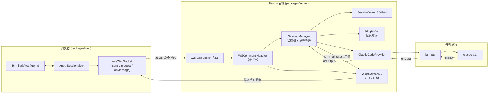
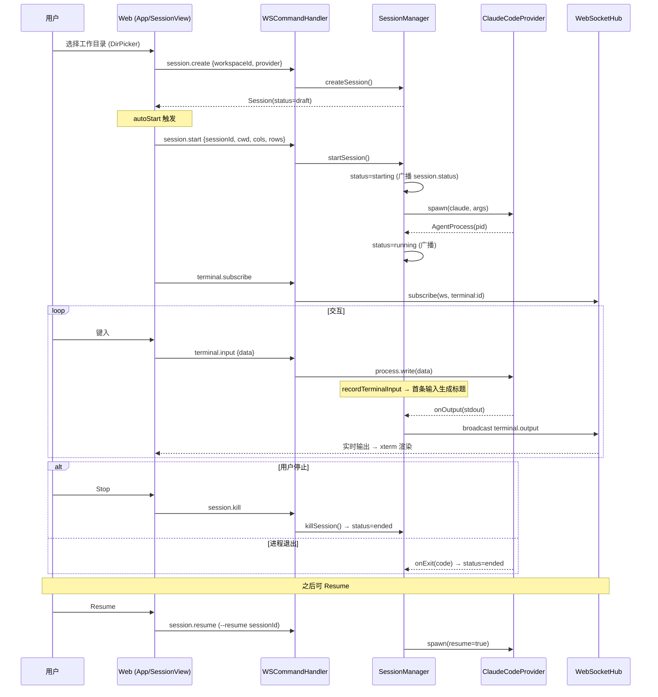
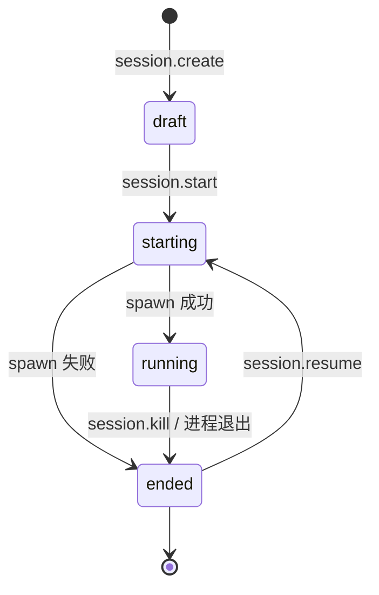
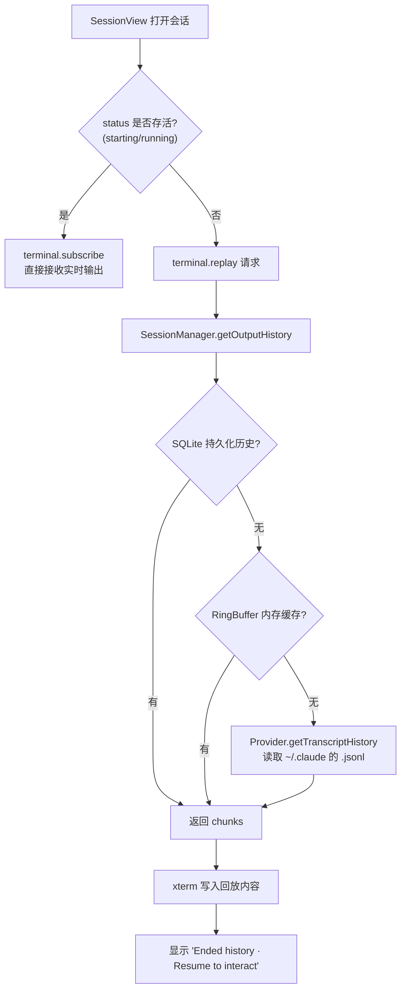

# Cubby — 架构与主流程

本文档描述 Cubby 当前实现的主流程，分三个层面：整体架构、会话生命周期状态机、终端历史回放。

Cubby 是一个浏览器端的自托管 AI 编码工作区。前端 React 通过 WebSocket（命令式 RPC）与 Fastify 后端通信，后端通过 Provider 拉起 `claude` CLI 的 PTY 进程，并把终端输出实时广播回前端。

## 1. 整体架构

## 2. 会话生命周期（主用户流程时序）

从「选目录建会话」到「启动 → 交互 → 停止 → 恢复」的完整链路：

### 状态机

`SESSION_STATUS = draft → starting → running → idle → ended`，状态变更通过 `SessionManager.onStatusChange` 监听器全量广播（`session.status` 事件）。

## 3. 终端历史与回放（Replay）

非存活会话（`ended`）打开时，前端请求历史回放；存活会话（`running`/`starting`）则直接订阅实时流。

## 关键设计点

- **协议**：前端到后端是请求/响应式命令（`session.*`、`terminal.*`），后端到前端是事件广播（`terminal.output`、`session.status`、`session.updated`）。`request()` 用 id 匹配响应，`onMessage()` 处理事件。
- **状态机**：`draft → starting → running → ended`（`SESSION_STATUS` 中还有 `idle`）。状态变更通过 `onStatusChange` 监听器全量广播。
- **进程托管**：`SessionManager` 用 `processes` Map 持有 PTY 进程；`reconcileDetachedLiveSessions()` 在启动时把没有对应进程却仍标记为存活的会话纠正为 `ended`。
- **输出多级缓存**：实时 `RingBuffer`（内存）+ SQLite 持久化 + Claude transcript 文件回退，保证会话重连后能恢复历史。
- **标题自动生成**：`recordTerminalInput` 捕获首条用户输入，提炼成会话标题。
